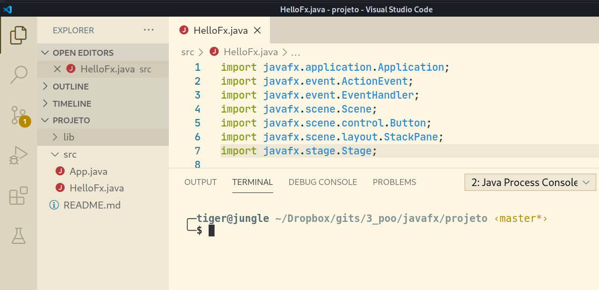
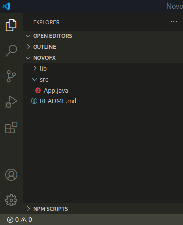
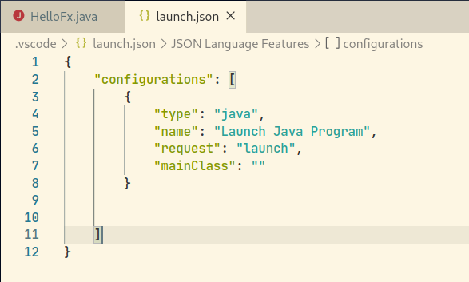
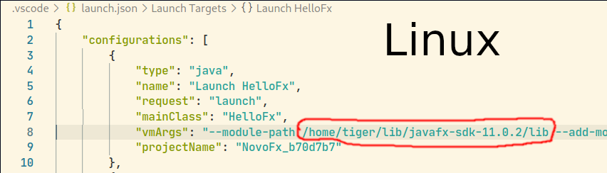

# Como configurar o javavx no vscode

<!--TOC_BEGIN-->
- [Configurando o vscode](#configurando-o-vscode)
- [Baixando o JavaFx](#baixando-o-javafx)
- [Modo Fácil](#modo-fácil)
- [Modo Manual](#modo-manual)
    - [Criando o projeto](#criando-o-projeto)
    - [Configurando o projeto](#configurando-o-projeto)
    - [Executando](#executando)
<!--TOC_END-->

## Configurando o vscode

- Abra seu vscode e instale as seguintes extensões
  - Java Extension Pack
  - Project Manager for java

## Baixando o JavaFx
- Baixar biblioteca do javafx 11 em [gluonhq](https://gluonhq.com/products/javafx/)
- Baixe o arquivo **JavaFX SDK** certo para seu SO.
- **Não** é o arquivo **jmods**.


- Após baixar, descompacte em alguma pasta e **anote** o path da pasta **lib**.
- No meu caso, o path para pasta lib ficou como
- `/home/tiger/lib/javafx-sdk-11.0.2/lib`


## Modo Fácil
- Clone esse repositório
```
git clone https://github.com/senapk/javafx_vscode
```
- Esse repositório contém uma pasta **projeto** que já contém um projeto JavaFx já pré-configurado.
- Copie a pasta lib do javafx para dentro da pasta **projeto** desse repositório.
- Agora a pasta **projeto** tem 2 pastas: `src` e `lib` e o arquivo `Readme.md`
- Abra a pasta o vscode **na pasta projeto**.



- Agora é só abrir o arquivo `HelloFx.java` e clicar na setinha `run`.
- Se for criar outro arquivo com `main`, após executar, abra o arquivo `.vscode/launch.json` e adicione o parâmetro `vmArgs` que já está configurado para o arquivo `HelloFx.java`.

## Modo Manual

### Criando o projeto

- Abra seu vscode
- Control - Shift - P
- Executar a opção `Java: Create Java Project`
- Selecione `No build tools`
- Selecione a pasta onde o projeto será criado.
- Selecione o nome do projeto, no meu caso: `JavaFxHello`
- O vscode já monta o projeto e abre uma nova instância na pasta correta.

### Configurando o projeto
- Abra o projeto criado:


- Abra o arquivo `src/App.java`
- Espera o vscode carregar o plugin "Java Projects"


- Vamos criar o arquivo `HelloFx.java` na mesma pasta `App.java` com o seguinte conteúdo.

```java
import javafx.application.Application;
import javafx.event.ActionEvent;
import javafx.event.EventHandler;
import javafx.scene.Scene;
import javafx.scene.control.Button;
import javafx.scene.layout.StackPane;
import javafx.stage.Stage;
 
public class HelloFx extends Application {
    public static void main(String[] args) {
        launch(args);
    }
    
    @Override
    public void start(Stage primaryStage) {
        primaryStage.setTitle("Hello World!");
        Button btn = new Button();
        btn.setText("Say 'Hello World'");
        btn.setOnAction(new EventHandler<ActionEvent>() {
 
            @Override
            public void handle(ActionEvent event) {
                System.out.println("Hello World!");
            }
        });
        
        StackPane root = new StackPane();
        root.getChildren().add(btn);
        primaryStage.setScene(new Scene(root, 300, 250));
        primaryStage.show();
    }
}
```
- Todos os imports de javafx estão em vermelho, o que significa que o vscode não sabe onde encontrar esses pacotes.


- Clique no + ao lado de `Referenced Libraries` e selecione os arquivos `.jar` que estão na pasta onde colocamos o `javafx`


- Isso deverá criar um arquivo `.vscode/settings.json` com o seguinte conteúdo.


- Com isso, o vscode já sabe onde achar o javafx e o imports do código não aparecerão mais em vermelho.

### Executando
- Se tentar executar pelo botão `run` terá a seguinte mensagem: 


- Isso acontece porque a execução de um projeto javafx exige que os módulos sejam passado por parâmetro para o `java`.

- Crie e salve o arquivo `.vscode/launch.json`.


- Clique em `Add Configuration...` -> `Java: Launch Program`



- Salve o arquivo e dê o `run` novamente o `HelloFx.java`. Ainda vai dar errado, mas irá criar automaticamente uma entrada *personalizada para o HelloFx* no arquivo `launch.json`.

- Adicione a seguinte entrada `vmArgs` nela **substituindo** o caminho pelo caminho onde está sua pasta lib.
- Observe que no Windows o path deve ser escrito com \\\\

```
"vmArgs": "--module-path CAMINHO_DA_SUA_PASTA_LIB --add-modules javafx.controls,javafx.base,javafx.fxml,javafx.graphics,javafx.media,javafx.web",
```





- Agora salva, executa e curte a janelinha:


